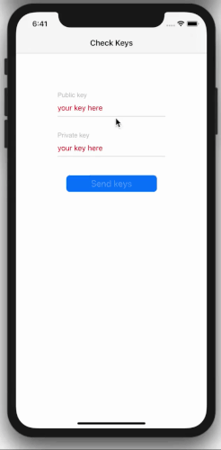
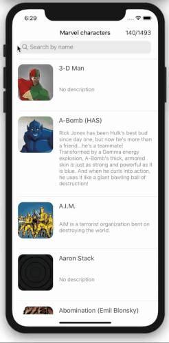
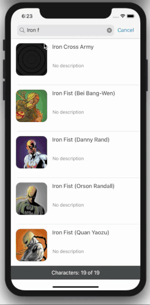
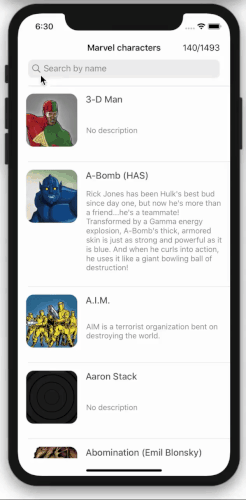
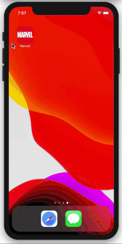
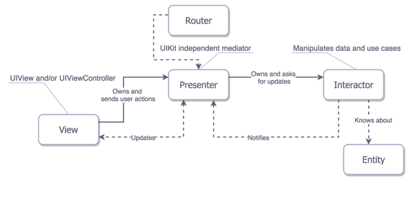
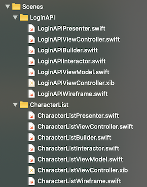
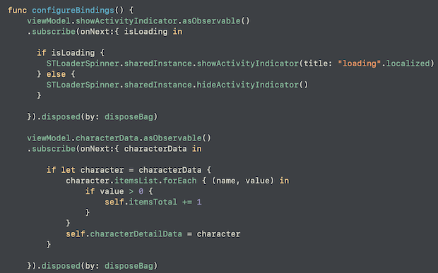
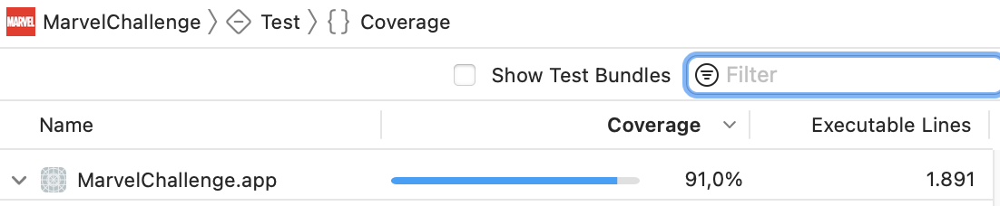

# Marvel Challenge

This demo app support iPhone and iPad layouts and implements the next screens:

- Login Keys Screen:

This screen let user to insert API keys in a secure way. The logical is like a login. The user needs to add the public and private keys. If the user write a wrong public or private key, a shake animation is displayed.

- Marvel character list with search:

The first screen consists of a list of Marvel characters. The list shows an image, the name and description of each Marvel character. All texts in this view are implemented with an automatic resize.

The list is paginated and you can see the actual character load from total in the right navigation view.

You can search a Marvel Character in entire Marvel API or filter for the first words of the name like, for exemple: "iro".  The search logical has a class to implement a timer delay to avoid massive search when user write a word. The logical search made a 2 second delay between searchs but if the user stop to write the search is launched. With the search result you can see a bottom view with the numeric information of the result searching. The result it is paginated too. 

Once you click on a Marvel character of the list you will be redirected to another screen with more specific information called Character Detail.

- Marvel character detail:

The second screen will display more detailed information about a Marvel character. Showing the name, description, and all the Comics and Series with two horizontal scroll views inside. The name and description have an automatic resized. And also implements a way to add pagination in both scrolls to save user internet data with infinite scroll.
You can tap on a comic or serie to navigate to another modal view and show it detail.

- Marvel expand detail:

The last screen is a extend detail for comics and series information.

  
  
Example gifs with iPhone 13 Xcode simulator:

        

        

     
  
Example gif with iPad Pro (9.7 inch) Xcode simulator:
 
  
 
   

# Architecture

The architecture used to this app is [VIPER based on my own templates](https://github.com/carlosmobile/VIPER-Xcode) this templates are based in a classic VIPER twisted with Clean Swift architecture based on SOLID principles introduced by Robert C. Martin (Uncle Bob).

  

This architecture has been used because it's considered an advance architecture that modulates the code and respect the clean code, SOLID principles and the best practices.

  

   

# RxSwift

RxSwift is added to VIPER architecture to improve the readability and maintainability of code. The app use RxSwift in the next situations:

Login Keys Screen scene uses RxSwift to control that the user write at least a character in each textField also to control spinner loader among others.

Character list and character detail scene uses RxSwift to update data from interactor and to show or hide the spinner loader when app calls the example JSON services as well to control if the user have an internet connection among others.

  

   

# Helpers

- [STLoaderSpinner](MarvelChallenge/Helpers/STLoaderSpinner.swift): Helper class to show custom spinner loader. 
- [ShakingTextField](MarvelChallenge/Helpers/ShakingTextField.swift): Helper to show error animation in logon keys scene. 
- [AutoSearchTimer](MarvelChallenge/Helpers/AutoSearchTimer.swift):  To implement a timer delay to avoid massive search when user write a word. The logical search made a 2 second delay between searchs but if the user stop to write the search is launched. 
- [SearchFooter](MarvelChallenge/Helpers/SearchFooter.swift): Helper to show the number of character that you are showing and the total number of characters filter in the searching. 
  

# Extension class

- [BorderBottom+UITextField](MarvelChallenge/Helpers/BorderBottom+UITextField.swift): To change the design of the Login Keys scene . 
- [CustomAlert+UIViewController](MarvelChallenge/Helpers/CustomAlert+UIViewController.swift): Helper to show a custom alert to block app when internet fails until user retry connection. 
- [Localized+String](MarvelChallenge/Helpers/Localized+String.swift): To improve the LocalizedString sintax. 
  

# Models

Structs:

- [Character](MarvelChallenge/Models/Character.swift): To model Marvel character. 
- [CharacterItems](MarvelChallenge/Models/CharacterItems.swift): To model Marvel character comics and series. 
- [MarvelUrl](MarvelChallenge/Models/MarvelUrl.swift): To model marvel url format. 
- [MarvelImage](MarvelChallenge/Models/MarvelImage.swift): To model marvel image format. 
  

# Networking

- [Alert](MarvelChallenge/Networking/Alert.swift): Struct to show to network alert error responses. 
- [APIConfiguration](MarvelChallenge/Networking/APIConfiguration.swift): Struct and enum to centralized network url and others. 
- [APIRequest](MarvelChallenge/Networking/APIRequest.swift): Class to implement request configuration. 
- [APIResponse](MarvelChallenge/Networking/APIResponse.swift): Extension to decode API response. 
- [APIError](MarvelChallenge/Networking/APIError.swift): Enum to handle error type. 
- [APIClient](MarvelChallenge/Networking/APIClient.swift): Class to implement URLSession. 
- [APIKeys](MarvelChallenge/Networking/APIKeys.swift): Class to implement Marvel API keys security and requirements. 
- [STReachability](MarvelChallenge/Networking/STReachability.swift): Class to control internet reachability. 

  
# XCTests

This app test Mocked API, Presenters, Interactors, Wireframes, Models, etc.. with [XCTests](MarvelTests/) and [UITests](MarvelTests/). 
Test Coverage 91%

  

  
# Swift Guide Style

The app code follows the [Ray Wenderlich Swift Style Guide](https://github.com/raywenderlich/swift-style-guide). 
  
# Centralized data

The app uses in "support" logical folder a [ThemeManager.swift](MarvelChallenge/Support/ThemeManager.swift) class to support centralized colors and images. It also uses multilanguage with Localizable.strings to centralized all the text in the app.
  
# Swift Package Manager

- [RxSwift](https://github.com/ReactiveX/RxSwift): Used to implement reactive programming in a easy way. 
- [KeychainAccess](https://github.com/kishikawakatsumi/KeychainAccess): Used to implement secure way to saved Marvel API keys. 
- [Kingfisher](https://github.com/onevcat/Kingfisher): Used to implement an easy way to download images from server with animation spinner and fade. 
  
# GitFlow

This app is developed using GifFlow, using only git commands and tool sourcetree.
  
# Design

The app try to implement nice design and UI/UX, respecting the iOS native elements as Apple guidelines and have a correct autolayout in its Xibs and implement the safe areas to correct view in last iPhone models. The app doesn't use storyboards and implement the SOLID Interface segregation principle. 

  

# Getting Started

Running in Xcode 13.2.1 and iOS 15.2 Written in Swift 5
  

# Next..

Mock API server with tool like [Swifter](https://github.com/httpswift/swifter) to launch UITests with mock data.
  
